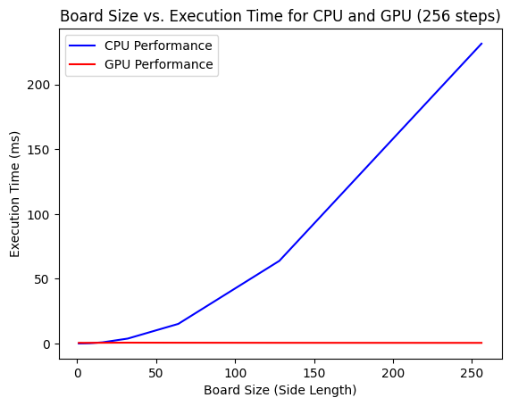
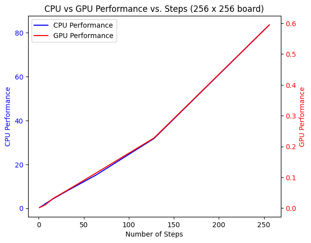

### Conway's Game of Life

In an effort to learn more about GPU programming using CUDA, I decided to implement [Conway's Game Of Life](https://en.wikipedia.org/wiki/Conway%27s_Game_of_Life), a zero-player cellular automata with a few simple rules that lead to incredibly complex outputs.

This game takes place on an NxN grid in which squares are either colored black (alive) or white (dead). Every "turn" or "step", the following rules apply:

1. Any live cell with fewer than two live neighbours dies, as if by underpopulation.
2. Any live cell with two or three live neighbours lives on to the next generation.
3. Any live cell with more than three live neighbours dies, as if by overpopulation.
4. Any dead cell with exactly three live neighbours becomes a live cell, as if by reproduction.

From there, the game repeats forever. Despite the simplicity of the rules, people have discovered interesting sub-structures such as ["spaceships"](https://conwaylife.com/wiki/spaceship) or ["guns"](https://conwaylife.com/wiki/gun). There's an incredible rabbit-hole to be immersed in if you find yourself with some time to kill :).

Since each cell in the grid acts independently, this game is wonderfully parallelizable.

On my NVIDIA GTX 1650, these are the results I got:

CPU Execution Time scales quadratically with respect to the board size (understandably), but GPU performance stays flat.

Both CPU and GPU Execution Time scale linearly with the number of steps (understandably).
